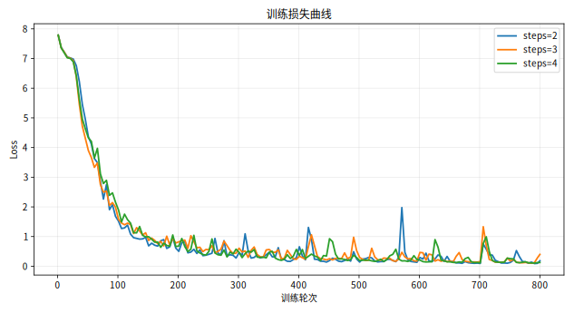
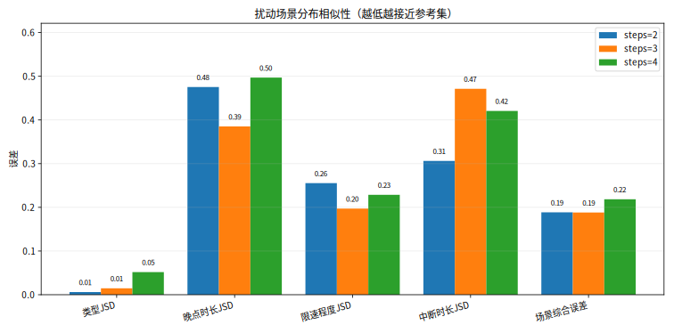
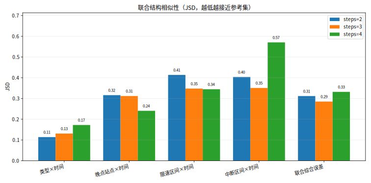
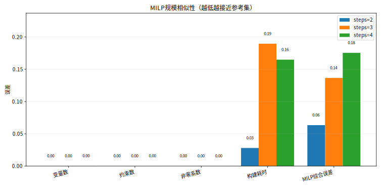
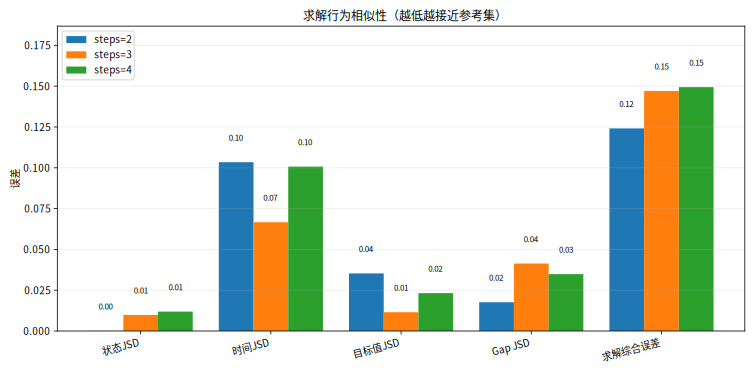
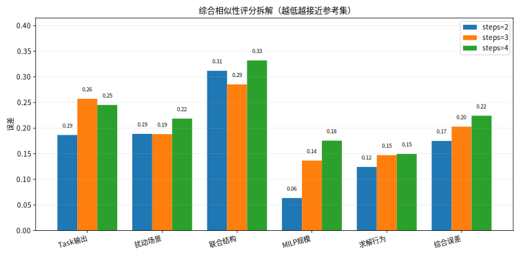

# GNN 传递步数消融实验报告

## 数据与口径

- 参考集 dataset：`outputs/gnn_steps/datasets/reference/`。
- 本报告由 `scripts/evaluate_ablation_similarity.py` 可重复生成；完整 JSON/CSV 输出位于 `outputs/gnn_steps_ablation/similarity_eval/`。
- 评估不重跑训练、generate、build 或 solve，只读取既有 run 产物。
- `limit_speed == 0` 计为中断，`limit_speed > 0` 计为普通限速；晚点时长、限速持续时长、限速值等扰动程度指标均使用分箱 JSD。
- 本报告对应的历史 solve CSV 没有 `num_nodes` 和 `t_first_feas`，因此分支节点数与首个可行解时间暂未纳入；当前 `scripts/bench_solve.py` 后续会记录 `num_nodes`。

## 指标解释

- 值相对误差回答“均值差多少”，适合变量数、约束数、平均求解时间等规模量。
- 分布相似性回答“整体形状是否像”，本报告对类别/分箱变量使用 JSD，对有序变量同时报告 Wasserstein/EMD 和 KS statistic。
- JSD 先把连续变量分箱再比较概率分布，因此 92 秒和 114 秒这类落在同一业务桶内的扰动不会被过度惩罚；但跨桶偏移会体现为分布差异。
- 联合结构指标比较 `扰动类型×时间段`、`站点/区间×时间段` 的联合直方图 JSD，用来判断模型是否学到了时空组合模式，而不只是单变量边际分布。

## 可视化

### 训练损失曲线

### 扰动场景分布相似性

### 联合结构相似性

### MILP规模相似性

### 求解行为相似性

### 综合相似性评分

## 关键结果

综合误差为 Task 输出、扰动场景、联合结构、MILP 规模、求解行为五个维度的一致权重平均值；相似度为 `1 - 综合误差`，越高越接近参考集。

| 组别 | best loss | Task输出误差 | 扰动场景误差 | 联合结构误差 | MILP误差 | 求解误差 | 综合误差 | 相似度 | solve状态 |
|---|---:|---:|---:|---:|---:|---:|---:|---:|---|
| steps=2 | 0.088 | 0.186 | 0.189 | 0.312 | 0.063 | 0.124 | 0.175 | 0.825 | ok=65, timeout=35 |
| steps=3 | 0.101 | 0.257 | 0.188 | 0.285 | 0.137 | 0.147 | 0.203 | 0.797 | ok=75, timeout=25 |
| steps=4 | 0.106 | 0.245 | 0.218 | 0.332 | 0.175 | 0.149 | 0.224 | 0.776 | ok=76, timeout=24 |

## 分项分析

综合五类误差后，`steps=2` 当前最接近参考集，综合误差为 `0.175`。这个结论同时考虑 task output、扰动场景、联合结构、MILP 规模和求解行为，不只依赖训练 loss。

- `steps=2`：扰动类型 JSD `0.006`，晚点程度 JSD `0.475`，限速程度 JSD `0.255`，联合结构平均 JSD `0.312`，约束数均值相对误差 `0.000`，求解状态 JSD `0.000`，求解时间 JSD `0.103`。
- `steps=3`：扰动类型 JSD `0.015`，晚点程度 JSD `0.385`，限速程度 JSD `0.197`，联合结构平均 JSD `0.285`，约束数均值相对误差 `0.000`，求解状态 JSD `0.010`，求解时间 JSD `0.067`。
- `steps=4`：扰动类型 JSD `0.052`，晚点程度 JSD `0.497`，限速程度 JSD `0.229`，联合结构平均 JSD `0.332`，约束数均值相对误差 `0.000`，求解状态 JSD `0.012`，求解时间 JSD `0.101`。

分项最优分别为：Task 输出：`steps=2` `0.186`；扰动场景：`steps=3` `0.188`；联合结构：`steps=3` `0.285`；MILP 规模：`steps=2` `0.063`；求解行为：`steps=2` `0.124`。

因此需要避免只看单项指标：`steps=3` 在扰动场景和联合结构上略优，但 Task 输出、MILP 规模和求解行为误差更高；`steps=4` 的扰动场景、联合结构和 MILP 规模误差进一步增大。`steps=2` 的优势在于 Task 输出、MILP 规模和求解行为更稳定地贴近参考集，综合上更可信。

从指标结构看，如果某组训练 loss 更低但联合结构或求解行为误差更高，说明它可能只学到了 task output 的局部统计，而没有充分复现铁路突发事件的时空组合和优化难度。相反，扰动程度分箱 JSD、联合结构 JSD、MILP 规模和求解行为同时接近参考集，才更能说明模型学到了可被 RailGraph2Gurobi 消化的真实扰动分布。

## 产物位置

- `outputs/gnn_steps_ablation/similarity_eval/metrics_summary.json`：完整指标。
- `outputs/gnn_steps_ablation/similarity_eval/group_summary.csv`：三组汇总表。
- `outputs/gnn_steps_ablation/similarity_eval/metric_long.csv`：长表指标，便于后续制图或论文表格。
- `outputs/gnn_steps_ablation/similarity_eval/sample_features.csv`：逐样本特征。
