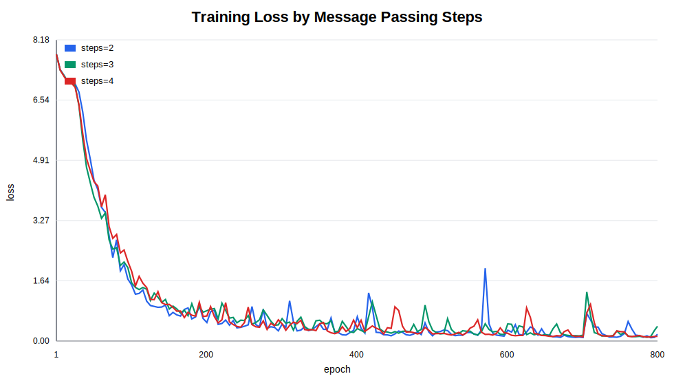
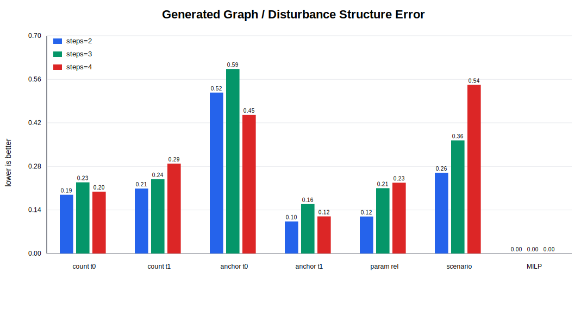
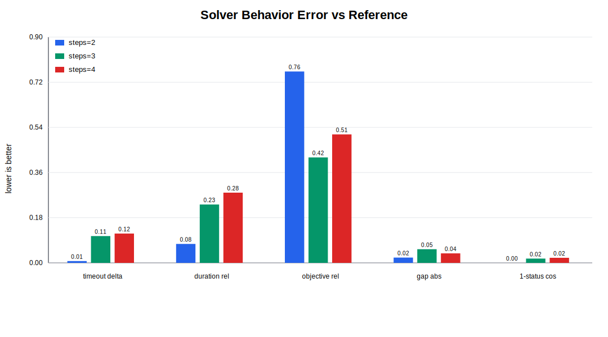

# GNN 传递步数消融实验报告

## 数据与口径

- 参考集已整理到 `outputs/gnn_steps_ablation/reference`，实际 build run 为 `/home/wula/zyjiang/RailGraph2Gurobi/outputs/bench_build/2026-05-25_16-13-18`。
- 三个消融组只改变 `model.message_passing_steps=2/3/4`，训练样本、隐藏维度、latent 维度、学习率、seed 和 loss 权重保持一致。
- generated solve 统一使用 `time-limit=120`、`workers=2`、`threads-per-solve=8`。
- 当前 `bench_solve.py` 的 CSV 没有记录 Gurobi 分支节点数 / `NodeCount`，旧日志也因 `quiet=True` 不含 Gurobi 节点日志；因此本报告不把分支节点作为定量结论，只比较可复现的 `status`、`duration_sec`、`objective` 和 `mip_gap`。
- 同一 BaseContext 下上下文图候选节点和上下文边固定，不能证明模型是否学到扰动；报告重点看生成 task output、解码扰动结构、MILP 规模和求解行为。

## 执行核验

- step2 迁移 build run 为 `/home/wula/zyjiang/RailGraph2Gurobi/outputs/bench_build/2026-05-25_18-50-02`，configs=`100`、graph samples=`100`、LP files=`500`、build 状态 `{'ok': 100}`；`context.json` 和 `dataset_profile.json` 均已存在。
- step2 已按统一配置重跑 solve/export/analyze：solve 状态 `{'ok': 65, 'timeout': 35}`，export 状态 `{'ok': 100}`，analyze 状态 `{'ok': 100}`。
- reference build run 已索引到 `outputs/gnn_steps_ablation/reference/build_run`，reference summary 文件已复制到 reference 目录。

## 可视化

### 训练 loss 变化

### 图结构 / 扰动结构误差

### 求解指标误差

## 关键结果

| 组别 | best loss | best epoch | count delta t0/t1 | anchor cosine t0/t1 | 场景结构平均误差 | 约束均值相对误差 | solve 状态 | 平均求解秒 | status cosine |
|---|---:|---:|---:|---:|---:|---:|---|---:|---:|
| steps=2 | 0.088 | 793 | 0.189/0.209 | 0.483/0.897 | 0.259 | 0.0000 | ok=65, timeout=35 | 50.448 | 1.000 |
| steps=3 | 0.101 | 786 | 0.229/0.239 | 0.407/0.841 | 0.363 | 0.0001 | ok=75, timeout=25 | 41.847 | 0.983 |
| steps=4 | 0.106 | 788 | 0.199/0.289 | 0.555/0.881 | 0.541 | 0.0002 | ok=76, timeout=24 | 39.266 | 0.980 |

参考集 solve 状态为 `ok=45, timeout=25`，平均求解秒为 `54.580`。

## 分析

综合生成分布和求解行为，`steps=2` 与参考集最接近。这个判断不是只看训练 loss，而是同时考虑 anchor 分布、扰动数量、扰动结构和 solve 状态分布。

- `steps=2`：best loss 为 `0.088`。task0/task1 的 anchor cosine 分别为 `0.483` 和 `0.897`；平均扰动数为 `2.240`。solve 状态 `{'ok': 65, 'timeout': 35}`，平均求解 `50.448` 秒，状态 cosine `1.000`。
- `steps=3`：best loss 为 `0.101`。task0/task1 的 anchor cosine 分别为 `0.407` 和 `0.841`；平均扰动数为 `2.310`。solve 状态 `{'ok': 75, 'timeout': 25}`，平均求解 `41.847` 秒，状态 cosine `0.983`。
- `steps=4`：best loss 为 `0.106`。task0/task1 的 anchor cosine 分别为 `0.555` 和 `0.881`；平均扰动数为 `2.330`。solve 状态 `{'ok': 76, 'timeout': 24}`，平均求解 `39.266` 秒，状态 cosine `0.980`。

从结果看，模型已经能学习到铁路突发场景的一部分统计结构：生成样本经过解码后全部可 build，且三组在统一 120 秒限制下都能全部得到可行解或最优解，没有无解文件的失败样本；这说明生成扰动大多落在合法锚点和合理参数区间内，能够形成可被 MILP 消化的铁路扰动实例。

但模型还没有完全复现参考集：task0 的 anchor 分布相似度明显低于 task1，说明列车事件级 delay 的落点更难学习；同时部分组的 timeout 比例和 mip gap 仍与参考集存在差异，表明生成样本的求解难度虽接近，但还会偏向某些更难或更易的扰动组合。

## 产物位置

- `outputs/gnn_steps_ablation/reference/`：参考集索引与 reference solve/export/analyze summary。
- `outputs/gnn_steps_ablation/steps_2/`：`steps=2` 的 train、generate、build、solve、export、analyze 和 solver difficulty 归档。
- `outputs/gnn_steps_ablation/steps_3/`：`steps=3` 的 train、generate、build、solve、export、analyze 和 solver difficulty 归档。
- `outputs/gnn_steps_ablation/steps_4/`：`steps=4` 的 train、generate、build、solve、export、analyze 和 solver difficulty 归档。
